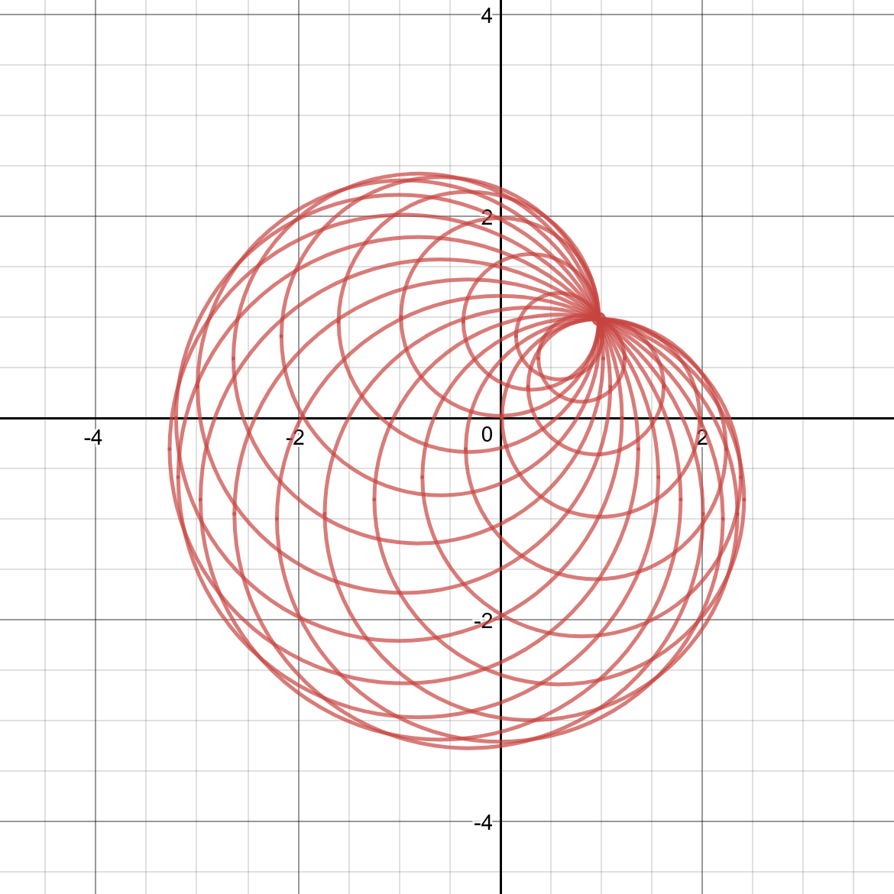
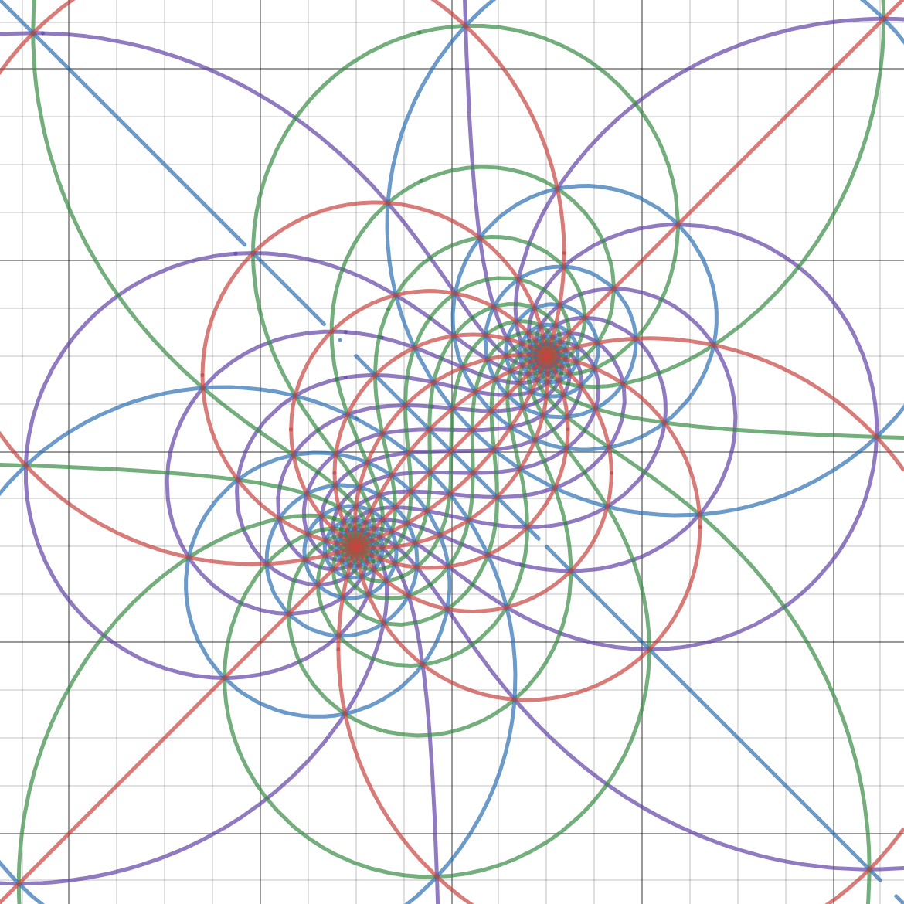

# Desmos Desktop

[Desmos](https://cul.acme.ml) 是一款优秀的、免费的在线数学函数计算器。它基于JavaScript，有在线版和手机版。这里是一个基于[Electron](http://electron.atom.io/)的**简单的离线桌面版**，可以离线绘制和保存以及输出截图。支持linux, Mac 和 Win平台(目前还没有在Mac上尝试，留下贫穷的眼泪...)。

  

  

  

Hope this helpful. Enjoy ;)
